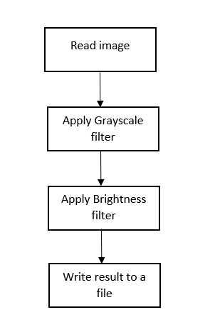

## Image Processing with CompletableFutures

You are provided with a base project that applies a simple image-processing pipeline. Each image is processed through
the following stages:



**Steps in the pipeline**:

* Read image from file.
* Apply Grayscale filter.
* Apply Brightness filter.
* Write the processed image to a new file.

You can download the base
code [here](https://moodle.isep.ipp.pt/pluginfile.php/90654/mod_resource/content/1/ImageProcessing.zip). The code
already includes:

* Methods to read and write image files
* Filter implementations
* A sequential implementation that processes 5 images from `1.jpg` to `5.jpg`

**Before proceeding**: Run and analyze the base sequential version to understand its structure and processing flow.

---

### Exercise 1 – Parallelize using ExecutorService

Improve the performance by parallelizing the image processing using an `ExecutorService` with `Callables` and `Futures`
objects. The goal is to create a thread pool to process multiple images concurrently.
Example logic (to be completed):

```text
for (int i = 1; i < NFILES+1; i++) {

    Color image1[][] = Utils.loadImage(String.valueOf(i)+".jpg");
    Callable<Color [][]> worker = new ProcessGrayFilter(image1, filters);
    Future<Color[][]> submit = executor.submit(worker);
    Callable<Color [][]> worker2 = new ProcessBrighterFilter(submit.get(), filters);
    Future<Color[][]> submit2 = executor.submit(worker2);
    Utils.writeImage(submit2.get(), String.valueOf(i)+"_processed.jpg");

}
```

**Note**: This approach waits for each image to be fully processed before starting the next. This causes blocking and
limits parallelism.

---

### Exercise 2 – Use CompletableFutures

To avoid blocking calls and improve efficiency, refactor the solution using `CompletableFuture`. Each image should be
processed asynchronously, allowing smaller images to finish sooner and freeing CPU resources faster.

**Expected behavior**:

* Images may be written out-of-order depending on how fast they are processed.
* The result should still be correct: each image is fully processed and written.

---

### Perspective

By completing this assignment, you will:

* Understand how and when to use `CompletableFutures`.
* Learn to coordinate processing steps across threads.
* Recognize the performance impact of `blocking` vs. `non-blocking` parallelism.